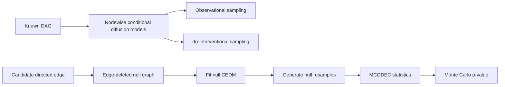

# Causality-Encoded Diffusion Models (CEDM)

[](https://arxiv.org/abs/2604.21843)
[](requirements.txt)
[](requirements.txt)

Official implementation of **Causality-Encoded Diffusion Models for Interventional
Sampling and Edge Inference** by Li Chen, Xiaotong Shen, and Wei Pan.

[Paper](https://arxiv.org/abs/2604.21843) ·
[Quick start](#quick-start) ·
[Reproduce the paper](#reproducing-the-paper) ·
[Citation](#citation)

CEDM factorizes diffusion learning according to a known directed acyclic graph (DAG),
training one conditional diffusion model for each node given its parents. The fitted model
supports both observational and `do`-interventional sampling. Its theoretical recovery
rates depend on the maximum local parent-child dimension rather than the ambient dimension.

CEDM-based inference (**CEDMI**) combines the fitted generator with the multivariate
conditional dependence coefficient (**MCODEC**) to test targeted directed edges. Under
sample splitting, CEDMI has asymptotic type-I error control.

## Method at a glance



| Component | Role |
|---|---|
| **CEDM** | DAG-aware observational and interventional sampling |
| **CEDMI** | Resampling-based inference for targeted directed edges |
| **MCODEC** | Rank-based, tuning-free multivariate conditional-dependence statistic |

### Highlights

- Encodes a known DAG through nodewise conditional score models.
- Generates samples from observational and interventional distributions.
- Establishes score-matching and total-variation guarantees governed by local dimension.
- Tests directed edges through null-graph resampling and MCODEC.
- Includes synthetic studies and a flow-cytometry application on the Sachs signalling data.

## Quick start

### Requirements

- Python **3.10.19**
- The packages pinned in [`requirements.txt`](requirements.txt)
- R and the `RCIT` package for [`Edge_Inference.Rmd`](flow_cytometry_inference/Edge_Inference.Rmd)
- A CUDA-capable GPU is recommended for the full diffusion experiments

Clone the repository and create an isolated Python environment:

```bash
git clone https://github.com/Cheems7019/CEDM.git
cd CEDM
python -m venv .venv
```

Activate the environment on Windows PowerShell:

```powershell
.venv\Scripts\Activate.ps1
```

Or on macOS/Linux:

```bash
source .venv/bin/activate
```

Install the dependencies:

```bash
python -m pip install --upgrade pip
python -m pip install -r requirements.txt
```

Model-training scripts default to a CUDA device. Where supported, use `--device cpu` to
run without a GPU, for example:

```bash
python simulations/inference_size_gamma_split.py --device cpu
```

## Reproducing the paper

Run all commands from the repository root. Simulation entry points normalize imports and
generated-artifact paths to the repository root when launched from another directory.

| Study | Entry points | Summary |
|---|---|---|
| Main Figure 1: interventional distribution recovery | [`*_data_comparison.py`](simulations) and [`*_distribution_comparison.py`](simulations) | [`summary_distribution_comparison.ipynb`](simulations/summary_distribution_comparison.ipynb) |
| Main Figures 2-3: edge inference with sample splitting | [`DataGen_inference_split.py`](simulations/DataGen_inference_split.py) and [`inference_*_split.py`](simulations) | [`summary_inference_split.ipynb`](simulations/summary_inference_split.ipynb) |
| Main Figure 5: shuffled flow-cytometry study | [`flow_cytometry_inference/`](flow_cytometry_inference) | [`flow_cytometry_shuffled_summary.ipynb`](flow_cytometry_inference/flow_cytometry_shuffled_summary.ipynb) |
| Original flow-cytometry analysis | [`cytometry_diffusion_training.py`](flow_cytometry_inference/cytometry_diffusion_training.py) and [`Edge_Inference.Rmd`](flow_cytometry_inference/Edge_Inference.Rmd) | CSV and PDF outputs |
| Supplementary simulations | Comparison, nonsplit-inference, and misspecification scripts | Summary notebooks in [`simulations/`](simulations) |

<details>
<summary><strong>Main Figure 1: interventional distribution recovery</strong></summary>

The study compares CEDM with a causality-agnostic diffusion model and VACA on the Hub,
Chain, Random-DAG, and Sachs structures. For each structure, generate the reference and
training data before running the distributional comparison.

```bash
python simulations/hub_data_comparison.py
python simulations/hub_distribution_comparison.py

python simulations/long_chain_data_comparison.py
python simulations/long_chain_distribution_comparison.py

python simulations/random_dag_data_comparison.py
python simulations/random_dag_distribution_comparison.py

python simulations/sachs_data_comparison.py
python simulations/sachs_distribution_comparison.py
```

Open [`simulations/summary_distribution_comparison.ipynb`](simulations/summary_distribution_comparison.ipynb)
to generate the figure. The notebook expects separately generated VACA CSV files in the
corresponding `results/*_distribution_comparison/vaca/` directories; VACA source code is
not bundled in this repository.

</details>

<details>
<summary><strong>Main Figures 2-3: conditional-independence testing</strong></summary>

These experiments use sample splitting: CEDM is trained on a held-out training set and
MCODEC is evaluated on a separate inference set.

Generate all deterministic train/inference splits once:

```bash
python simulations/DataGen_inference_split.py
```

Run CEDMI for empirical size and power:

```bash
python simulations/inference_size_gamma_split.py
python simulations/inference_size_eta_split.py
python simulations/inference_power_gamma_split.py
python simulations/inference_power_eta_split.py
```

Open [`simulations/summary_inference_split.ipynb`](simulations/summary_inference_split.ipynb)
to produce the figures. Implementations of comparison methods are not bundled; obtain them
from the original sources listed under [External comparison methods](#external-comparison-methods).

</details>

<details>
<summary><strong>Main Figure 5: shuffled flow-cytometry study</strong></summary>

The scripts assess four disputed linkages between the literature-consensus network and the
Sachs Bayesian network:

- p44/42 to Akt (S473)
- PIP3 to Akt (S473)
- PIP2/PLCg to PKC
- PKC to PKA

Before running them, provide shuffled datasets named `Flow_Cytometry_1.csv`,
`Flow_Cytometry_2.csv`, and so on. By default the scripts read these files from
`flow_cytometry_inference/shuffled_data/`; alternatively, pass a directory using
`--shuffled-dir`. These generated shuffled inputs are not included in the repository.

```bash
python flow_cytometry_inference/p44_42_to_pakts473_shuffled.py
python flow_cytometry_inference/pip2_plcg_pkc_shuffled.py
python flow_cytometry_inference/pip3_pakts473_shuffled.py
python flow_cytometry_inference/pkc_pka_shuffled.py
```

Open [`flow_cytometry_shuffled_summary.ipynb`](flow_cytometry_inference/flow_cytometry_shuffled_summary.ipynb)
to summarize rejection rates and generate the figure.

</details>

<details>
<summary><strong>Original flow-cytometry analysis</strong></summary>

The repository includes the preprocessed Sachs data in
[`Flow_Cytometry.csv`](flow_cytometry_inference/Flow_Cytometry.csv).

Train CEDM in Python:

```bash
python flow_cytometry_inference/cytometry_diffusion_training.py
```

Then open and run [`flow_cytometry_inference/Edge_Inference.Rmd`](flow_cytometry_inference/Edge_Inference.Rmd)
in R to perform edge inference with `RCIT`.

</details>

<details>
<summary><strong>Supplementary simulations</strong></summary>

Conditional-expectation estimation (Supplementary Figure 1):

```bash
python simulations/hub_comparison.py
python simulations/random_dag_comparison.py
python simulations/long_chain_comparison.py
python simulations/sachs_comparison.py
```

Summarize with [`simulations/summary_comparison.ipynb`](simulations/summary_comparison.ipynb).

Inference without sample splitting (Supplementary Figures 2-4):

```bash
python simulations/inference_size_gamma.py
python simulations/inference_size_eta.py
python simulations/inference_power_gamma.py
python simulations/inference_power_eta.py
```

Summarize with [`simulations/summary_inference.ipynb`](simulations/summary_inference.ipynb).

Sachs working-graph misspecification (Supplementary Figure 6):

```bash
python simulations/inference_sachs_misspecification.py
```

</details>

### Generated artifacts

Generated data, checkpoints, and results are intentionally excluded from version control.

| Path | Contents |
|---|---|
| `data/` | Synthetic datasets, reference samples, and graph structures |
| `ckpt/` | Trained diffusion-model checkpoints |
| `results/` | Simulation CSV files, summaries, and figures |
| `flow_cytometry_inference/checkpoints*/` | Flow-cytometry model checkpoints |
| `flow_cytometry_inference/results*/` | Flow-cytometry inference and diagnostic results |

## Repository layout

| Path | Purpose |
|---|---|
| [`utils/conditional_ddpm.py`](utils/conditional_ddpm.py) | Nodewise conditional diffusion models and CEDM sampling |
| [`utils/ddpm.py`](utils/ddpm.py) | Causality-agnostic joint-diffusion baseline |
| [`utils/utils_model.py`](utils/utils_model.py) | Diffusion-network architecture |
| [`utils/utils_data.py`](utils/utils_data.py) | Synthetic data generators and ground-truth conditionals |
| [`utils/mcodec.py`](utils/mcodec.py) | MCODEC and CODEC statistics |
| [`simulations/`](simulations) | Main-text and supplementary simulation entry points |
| [`flow_cytometry_inference/`](flow_cytometry_inference) | Sachs-data training, inference, diagnostics, and summaries |
| [`requirements.txt`](requirements.txt) | Tested Python dependency versions |

## Method details

### CEDM architecture

Each node group has its own conditional diffusion model. The noise-prediction network takes
the noisy child group, the observed parent groups, and a sinusoidal time embedding:

```text
[noisy child | observed parents | time embedding]
    -> SiLU MLP (512 -> 256 -> 256 -> 256 -> 128)
    -> predicted child noise
```

Training uses denoising score matching with a linear beta schedule from `1e-4` to `0.02`
and `T = 1000` diffusion steps. Models are trained in topological order.

### CEDMI procedure

For a candidate directed edge:

1. Remove the edge and fit CEDM under the resulting null graph.
2. Compute the observed MCODEC statistic on the inference sample.
3. Generate `D = 100` null resamples of the child from the fitted conditional model.
4. Recompute MCODEC for every resample.
5. Return the Monte Carlo p-value `(1 + #{tau_d >= tau}) / (D + 1)`.

### MCODEC

For multivariate child `X_j`, candidate parent `X_k`, and remaining parents `Z`:

```text
MCODEC(X_j, X_k | Z)
    = [xi(X_j, (Z, X_k)) - xi(X_j, Z)] / [1 - xi(X_j, Z)]
```

Here `xi` is the Ansari-Fuchs multi-output extension of the Azadkia-Chatterjee rank
correlation.

## External comparison methods

Third-party competitor implementations are intentionally not included. They are available
from their original sources:

| Method | Reference | Source |
|---|---|---|
| SGMCIT | Ren et al., KDD 2025 | [GitHub](https://github.com/jinchenghou123/SGMCIT) |
| NNLSCIT | Li et al., NeurIPS 2023 | [GitHub](https://github.com/LeeShuai-kenwitch/NNLSCIT) |
| CDCIT | Yang et al., AAAI 2025 | [GitHub](https://github.com/Yanfeng-Yang-0316/CDCIT) |
| CCIT | Sen et al., NeurIPS 2017 | Python package `ccit` |
| RCoT / RCIT | Strobl et al., JCI 2019 | R package `RCIT` |
| VACA | Sanchez-Martin et al., AAAI 2022 | [GitHub](https://github.com/psanch21/VACA) |

## Citation

If you use this code, please cite:

```bibtex
@article{chen2026causality,
  title   = {Causality-Encoded Diffusion Models for Interventional Sampling and Edge Inference},
  author  = {Chen, Li and Shen, Xiaotong and Pan, Wei},
  journal = {arXiv preprint arXiv:2604.21843},
  year    = {2026}
}
```

## Questions and feedback

For questions about the implementation or reproducibility, please open a GitHub issue.
